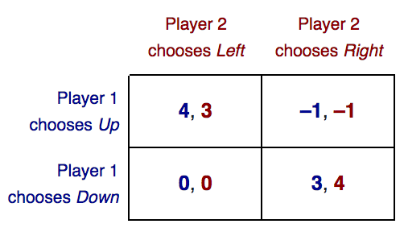
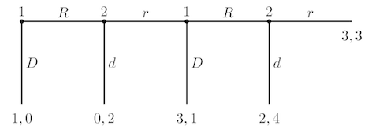

# Game Theory Cheat Sheet

**Game theory** is the study of mathematical models of conflict and cooperation between intelligent rational 
decision-makers.
Game theory is mainly used in economics, political science, and psychology, as well as logic, computer science and 
biology.

## Table of Content

- [Game Representations](#game-representations)
- [Classification of Games](#classification-of-games)
- [Commonly Known Games](#commonly-known-games)
- [Useful Links](#useful-links)

## Game Representations

**Players**: who are the decision makers?
- People? Governments? Companies? Somebody employed by a Company?...

**Actions**: what can the players do?
- Enter a bid in an auction? Decide whether to end a strike? Decide when to sell a stock? Decide how to vote?...

**Payoffs**: what motivates players?
- Do they care about some profit? Do they care about other players?...

#### Normal form

Lists what payoffs players get as a function of their actions. Usually represented by a matrix:

#### Extensive form

Includes timing of moves. Usually represented by a tree.

## Classification of Games

<table style="table-layout:fixed">
  <colgroup>
    <col style="width:50%"/>
    <col style="width:50%"/>
  </colgroup>
  <tr>
    <td>
      
<b>Simultaneous game</b> (a.k.a. Strategy game) - a game where both players move simultaneously, or if they do
       not move simultaneously, the later players are unaware of the earlier players' actions (making them effectively
        simultaneous).
      
Usually normal form is used to represent simultaneous games.
    </td>
    <td>
      
<b>Sequential game</b> (a.k.a. Extensive game) - a game where later players have some knowledge about earlier 
      actions.
      
Usually extensive form is used to represent sequential games.
    </td>
  </tr>
  <tr>
    <td>
      <b>Cooperative game</b> - a game where the players are able to form binding commitments externally enforced (e.g.
      through contract law).
    </td>
    <td>
      <b>Non-cooperative game</b> - a game where players cannot form alliances or if all agreements need to be
      self-enforcing (e.g. through credible threats).
    </td>
  </tr>
  <tr>
    <td>
      <b>Zero-sum game</b> - a game in which each participant's gain or loss of utility is exactly balanced by the
      losses or gains of the utility of the other participants.
    </td>
    <td>
      <b>Non-zero-sum game</b> - a game in which the interacting parties' aggregate gains and losses can be less
      than or more than zero.
    </td>
  </tr>
  <tr>
    <td>
      <b>Perfect information game</b> - a game in which all players know the moves previously made by all other players.
    </td>
    <td>
      <b>Imperfect information game</b> - a game in which some players don't know the moves previously made by other 
      players.
    </td>
  </tr>
  <tr>
    <td>
      <b>Complete information game</b> - a game in which all players know the strategies and payoffs available to the 
      other players.
    </td>
    <td>
      <b>Incomplete information game</b> - a game in which some players don't know the strategies or payoffs available
      to the other players.
    </td>
  </tr>
  <tr>
    <td>
      <b>Finite game</b> - a game that lasts for finite number of moves.
    </td>
    <td>
      <b>Infinite game</b> - a game that lasts for infinite number of moves.
    </td>
  </tr>
</table>

## [Commonly Known Games](https://en.wikipedia.org/wiki/List_of_games_in_game_theory)

#### [Prisoner's Dilemma](https://en.wikipedia.org/wiki/Prisoner%27s_dilemma)

|                 | **Stay silent**       | **Betray**          |
| ---             | ---                   | ---                 |
| **Stay silent** | -1,-1                 | -3,0                |
| **Betray**      | 0,-3                  | **-2,-2**           |

- There is 1 NE:
  - Both players betray. 
- This is a dominant strategies NE. 
- It is also the only non Pareto optimal outcome in this game.

#### [Matching Pennies](https://en.wikipedia.org/wiki/Matching_pennies)
 
|                      | **Play heads**      | **Play tails**     |
| ----                 | ---                 | ---                |
| **Play heads**       | 1,-1                | -1,1               |
| **Play tails**       | -1,1                | 1,-1               |
 
- There is 1 NE:
  - Mixed strategies NE: each player chooses heads or tails with probability 0.5.
- It's a zero-sum game.

#### [Battle of the Sexes](https://en.wikipedia.org/wiki/Battle_of_the_sexes_(game_theory))
 
|                          | **Go to opera**       | **Go to football**       |
| ---                      | ---                   | ---                      |
| **Go to opera**          | **3,2**               | 0,0                      |
| **Go to football**       | 0,0                   | **2,3**                  |
 
- There are 3 NE:
  - Both players go to opera
  - Both players go to football
  - Mixed strategies NE: He goes to opera with probability 3/5, She goes to opera with probability 2/5.
  
#### Stag Hunt
 
|                          | **Hunt stag**         | **Hunt hare**            |
| ---                      | ---                   | ---                      |
| **Hunt stag**            | **2,2**               | 0,1                      |
| **Hunt hare**            | 1,0                   | **1,1**                  |
 
- There are 3 NE:
  - Both players hunt stag
  - Both players hunt hare
  - Mixed strategies NE: He hunts stag with probability 2/3, She hunts stag with probability 2/3.

#### Free Money
 
|                      | **Play heads**      | **Play tails**     |
| ----                 | ---                 | ---                |
| **Play heads**       | **1,1**             | 0,0                |
| **Play tails**       | 0,0                 | **0,0**            |
 
- There are 2 NE (a rare case when there is an even number of NE):
  - Both players play heads
  - Both players play tails
  
#### [Chicken](https://en.wikipedia.org/wiki/Chicken_(game))
 
|                      | **Swerve**          | **Straight**        |
| ----                 | ---                 | ---                 |
| **Swerve**           | 0,0                 | **-1,1**            |
| **Straight**         | **1,-1**            | -10,-10             |
 
- Anti-coordination games - it is mutually beneficial for the players to play different strategies.
- There are 3 NE:
  - He swerves, she goes straight
  - He goes straight, she swerves
  - Mixed strategy NE: He swerves with probability 9/10, She swerves with probability 9/10
  
#### [Centipede Game](https://en.wikipedia.org/wiki/Centipede_game)

- SPE: each player chooses to defect at every opportunity.
  
## Useful Links

- Game Solver (2x2 matrix games): http://mindyourdecisions.com/GameSolver.html
